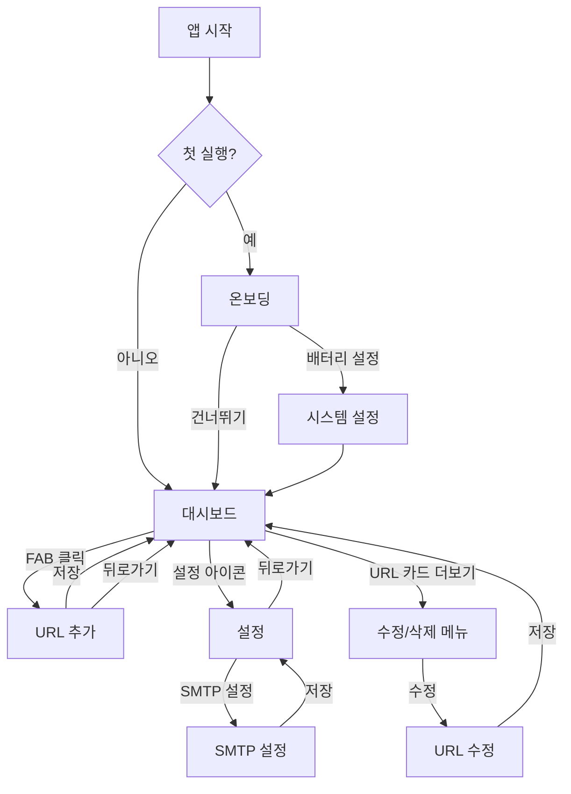

# 렌더웨이크 UI 모크업 명세서

## 개요

렌더웨이크(Render Wake-Up) 앱은 Render 무료 플랜 서버를 슬립모드에서 깨우기 위한 안드로이드 앱입니다. 이 문서는 앱의 주요 사용자 흐름에 대한 UI 모크업 명세를 제공합니다.

## 디자인 시스템

### 색상 팔레트
- **Primary**: #0D47A1 (진한 파란색)
- **Secondary**: #00BFA5 (청록색)
- **Accent**: #FF6D00 (주황색)
- 그레이스케일 및 상태 색상은 design_tokens.md 참조

### UI 가이드라인
- 버튼 및 입력 필드: 라운드 모서리 8dp
- 텍스트 여백: 16dp
- 아이콘 사이즈: 24dp
- 카드 엘리베이션: 2dp
- 리스트 아이템 간격: 8dp

## 사용자 여정 (User Journey)

```
설치 → 권한 요청 → URL 추가 → 백그라운드 핑 → 대시보드 확인 → 즉시 깨우기
```

## 화면 구성

### 1. 온보딩 화면 (/onboarding)

**목적**: 앱 설치 후 배터리 최적화 권한 안내 및 기본 사용법 설명

**레이아웃 구조**:
```
+----------------------------------+
|                                  |
|            [이미지 영역]          |
|                                  |
+----------------------------------+
|                                  |
|           배터리 최적화           |
|                                  |
| 앱이 백그라운드에서 계속 실행되려면 |
| 배터리 최적화 제외 설정이 필요합니다.|
|                                  |
+----------------------------------+
|                                  |
|        [배터리 설정 열기 버튼]     |
|                                  |
|           [건너뛰기 버튼]         |
|                                  |
+----------------------------------+
```

**주요 컴포넌트**:
- 상단 일러스트레이션: 배터리와 서버 연결 이미지
- 설명 텍스트: 배터리 최적화 제외의 중요성 설명
- 기본 버튼(Primary): "배터리 설정 열기"
- 텍스트 버튼(Secondary): "건너뛰기"

**상호작용**:
- "배터리 설정 열기" 버튼 클릭 시 시스템 배터리 최적화 설정 화면으로 이동
- "건너뛰기" 버튼 클릭 시 대시보드 화면으로 이동

### 2. 대시보드 화면 (/dashboard)

**목적**: 등록된 URL 목록 표시 및 상태 모니터링

**레이아웃 구조**:
```
+----------------------------------+
| 렌더웨이크             [설정 아이콘] |
+----------------------------------+
| [상태 배너: 서비스 실행 중]        |
+----------------------------------+
|                                  |
| [URL 카드 1]                     |
|   example.com                    |
|   5분 간격 | 마지막 핑: 1분 전     |
|   [상태: 정상]       [더보기 메뉴] |
|                                  |
+----------------------------------+
|                                  |
| [URL 카드 2]                     |
|   myapp.render.com              |
|   10분 간격 | 마지막 핑: 3분 전    |
|   [상태: 정상]       [더보기 메뉴] |
|                                  |
+----------------------------------+
|                                  |
| [URL 카드 3]                     |
|   api.myproject.com             |
|   15분 간격 | 마지막 핑: 실패      |
|   [상태: 오류]       [더보기 메뉴] |
|                                  |
+----------------------------------+
|                                  |
|                                  |
|                                  |
|                [+ 버튼(FAB)]     |
+----------------------------------+
```

**주요 컴포넌트**:
- 앱바: 앱 제목과 설정 아이콘
- 상태 배너: 서비스 실행 상태 표시
- URL 카드 리스트: RecyclerView로 구현
  - URL 주소
  - 호출 주기
  - 마지막 핑 시간/상태
  - 상태 표시 (정상/오류)
  - 더보기 메뉴 (수정/삭제)
- 플로팅 액션 버튼(FAB): URL 추가

**상호작용**:
- FAB 클릭 시 URL 추가 화면으로 이동
- URL 카드 클릭 시 상세 정보 표시
- 더보기 메뉴 클릭 시 수정/삭제 옵션 표시
- 설정 아이콘 클릭 시 설정 화면으로 이동
- 상태 배너 클릭 시 서비스 상태 상세 정보 표시

### 3. URL 추가 화면 (/add-url)

**목적**: 새로운 URL 및 호출 주기 설정 추가

**레이아웃 구조**:
```
+----------------------------------+
| [뒤로가기] URL 추가               |
+----------------------------------+
|                                  |
| URL                              |
| [                              ] |
| https://example.render.com       |
|                                  |
| 호출 주기 (분)                    |
| [                              ] |
| 10                               |
|                                  |
| 이메일 알림                       |
| [토글 스위치]                     |
|                                  |
| 알림 이메일 주소                  |
| [                              ] |
| user@example.com                 |
|                                  |
+----------------------------------+
|                                  |
|            [저장 버튼]           |
|                                  |
+----------------------------------+
```

**주요 컴포넌트**:
- 앱바: 뒤로가기 버튼과 화면 제목
- URL 입력 필드: TextField
- 호출 주기 입력 필드: NumberPicker 또는 슬라이더
- 이메일 알림 토글 스위치
- 이메일 주소 입력 필드 (토글 활성화 시에만 표시)
- 저장 버튼: 입력 내용 저장

**상호작용**:
- 뒤로가기 버튼 클릭 시 대시보드 화면으로 이동
- 저장 버튼 클릭 시 입력 내용 검증 후 저장하고 대시보드로 이동
- 이메일 알림 토글 변경 시 이메일 주소 입력 필드 표시/숨김
- URL 입력 필드에 포커스 시 키보드 표시

### 4. 설정 화면 (/settings)

**목적**: 앱 전반적인 설정 관리

**레이아웃 구조**:
```
+----------------------------------+
| [뒤로가기] 설정                   |
+----------------------------------+
|                                  |
| 일반                             |
+----------------------------------+
| 자동 시작                         |
| 기기 재부팅 시 자동으로 앱 실행     |
| [토글 스위치]                     |
+----------------------------------+
| 포그라운드 서비스                  |
| 앱이 항상 실행되도록 유지          |
| [토글 스위치]                     |
+----------------------------------+
|                                  |
| 알림                             |
+----------------------------------+
| 이메일 알림                       |
| 서버 응답 실패 시 이메일 알림 발송  |
| [토글 스위치]                     |
+----------------------------------+
| SMTP 설정                        |
| 이메일 발송을 위한 SMTP 서버 설정  |
| >                               |
+----------------------------------+
|                                  |
| 정보                             |
+----------------------------------+
| 앱 버전                          |
| 1.0.0                           |
+----------------------------------+
| 개발자 정보                       |
| >                               |
+----------------------------------+
```

**주요 컴포넌트**:
- 앱바: 뒤로가기 버튼과 화면 제목
- 설정 섹션: 일반, 알림, 정보
- 설정 항목: 제목, 설명, 컨트롤(토글 스위치, 버튼 등)
- 하위 메뉴 항목: 화살표 아이콘으로 표시

**상호작용**:
- 뒤로가기 버튼 클릭 시 대시보드 화면으로 이동
- 토글 스위치 변경 시 해당 설정 즉시 적용
- SMTP 설정 클릭 시 SMTP 서버 설정 화면으로 이동
- 개발자 정보 클릭 시 개발자 정보 화면으로 이동

## 컴포넌트 명세

### 공통 컴포넌트

#### 1. 앱바
- 높이: 56dp
- 배경색: Primary (#0D47A1)
- 제목 텍스트: H2 스타일, 흰색
- 아이콘: 24dp, 흰색

#### 2. 버튼
- 기본 버튼(Primary):
  - 배경색: Primary (#0D47A1)
  - 텍스트 색상: 흰색
  - 패딩: 수평 16dp, 수직 8dp
  - 모서리 반경: 8dp
  
- 보조 버튼(Secondary):
  - 배경색: 투명
  - 테두리: 1dp, Primary (#0D47A1)
  - 텍스트 색상: Primary (#0D47A1)
  - 패딩: 수평 16dp, 수직 8dp
  - 모서리 반경: 8dp

#### 3. 입력 필드
- 높이: 56dp
- 배경색: 흰색
- 테두리: 1dp, Gray 300 (#E0E0E0)
- 포커스 테두리: 2dp, Primary (#0D47A1)
- 레이블 색상: Gray 600 (#757575)
- 텍스트 색상: Gray 900 (#212121)
- 모서리 반경: 8dp
- 패딩: 수평 16dp

#### 4. 카드
- 배경색: 흰색
- 엘리베이션: 2dp
- 모서리 반경: 8dp
- 패딩: 16dp
- 마진: 8dp

#### 5. 플로팅 액션 버튼(FAB)
- 크기: 56dp
- 배경색: Secondary (#00BFA5)
- 아이콘 색상: 흰색
- 아이콘 크기: 24dp
- 엘리베이션: 6dp

## 반응형 디자인 가이드라인

- 최소 화면 너비: 320dp
- 최대 컨텐츠 너비: 600dp (태블릿에서 중앙 정렬)
- 방향 전환 대응:
  - 세로 모드: 단일 컬럼 레이아웃
  - 가로 모드: 대시보드에서 그리드 레이아웃 (2열)

## 더미 데이터

### URL 목록 더미 데이터
```json
[
  {
    "id": 1,
    "url": "https://example.render.com",
    "interval": 5,
    "lastPing": "2025-09-13T10:25:30Z",
    "status": "success",
    "failCount": 0
  },
  {
    "id": 2,
    "url": "https://myapp.render.com",
    "interval": 10,
    "lastPing": "2025-09-13T10:20:15Z",
    "status": "success",
    "failCount": 0
  },
  {
    "id": 3,
    "url": "https://api.myproject.com",
    "interval": 15,
    "lastPing": "2025-09-13T10:15:00Z",
    "status": "error",
    "failCount": 3
  }
]
```

### 설정 더미 데이터
```json
{
  "autoStart": true,
  "foregroundService": true,
  "emailNotification": true,
  "emailAddress": "user@example.com",
  "smtp": {
    "server": "smtp.gmail.com",
    "port": 587,
    "username": "user@gmail.com",
    "password": "app-password",
    "ssl": true
  }
}
```

## 구현 노트

1. 모든 화면은 Jetpack Compose로 구현
2. 상태 관리는 ViewModel과 StateFlow 사용
3. 네비게이션은 Jetpack Navigation Compose 사용
4. 다크 모드 지원을 위한 색상 리소스 분리
5. 접근성 지원을 위한 적절한 컨텐츠 설명 추가

## 화면 간 전환 흐름



## 스크린샷 및 프로토타입

실제 구현 시 Figma 또는 다른 디자인 도구를 사용하여 상세 디자인 및 프로토타입 제작 예정
